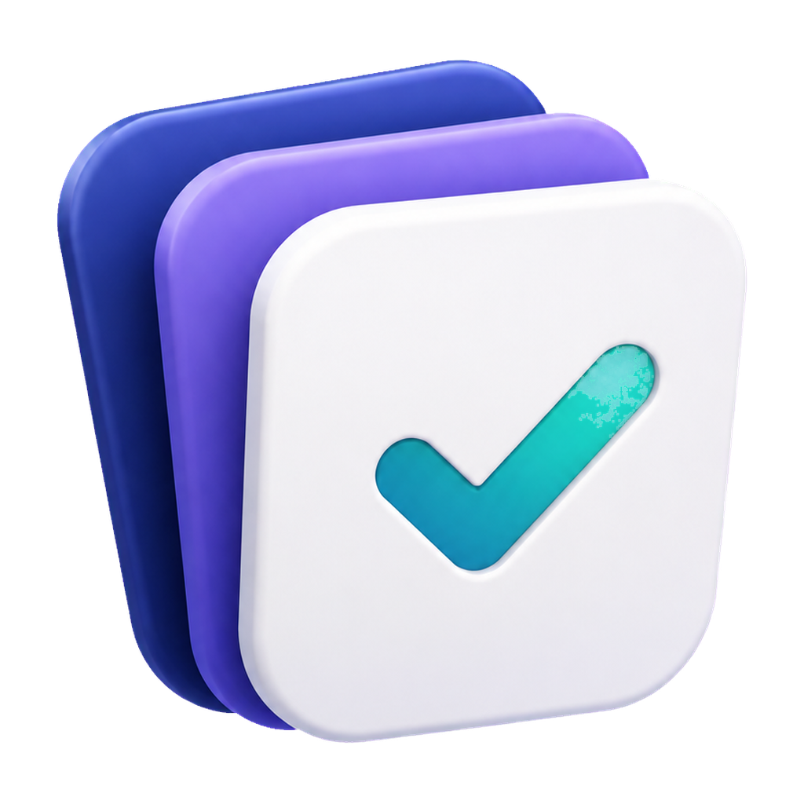
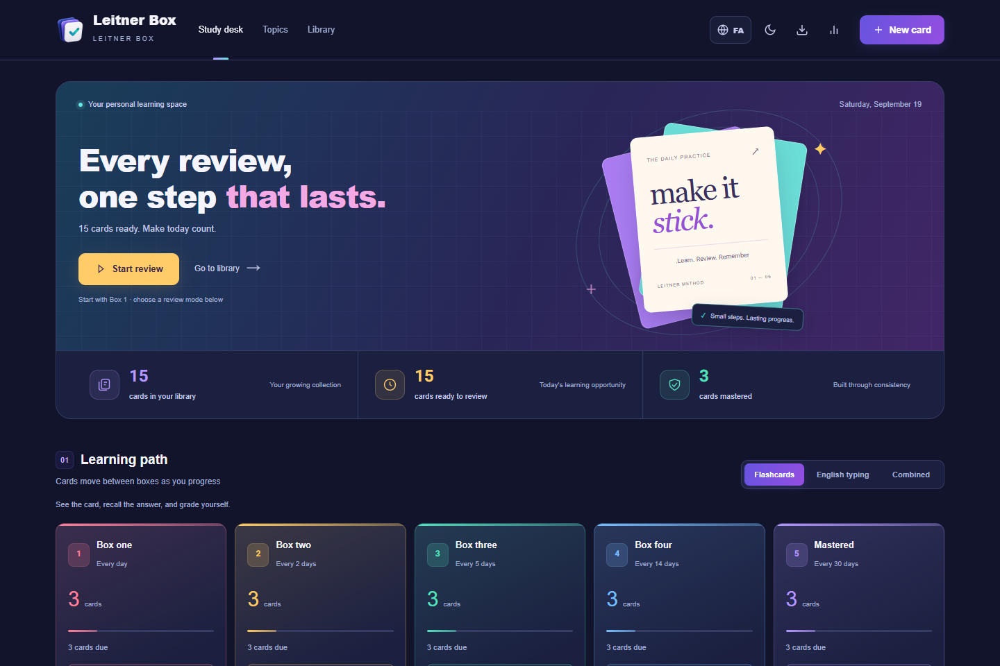
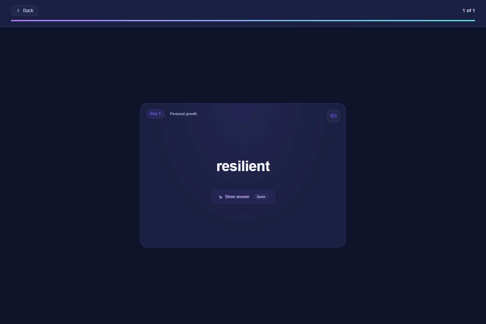
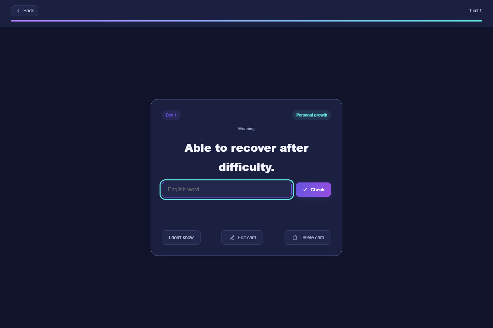
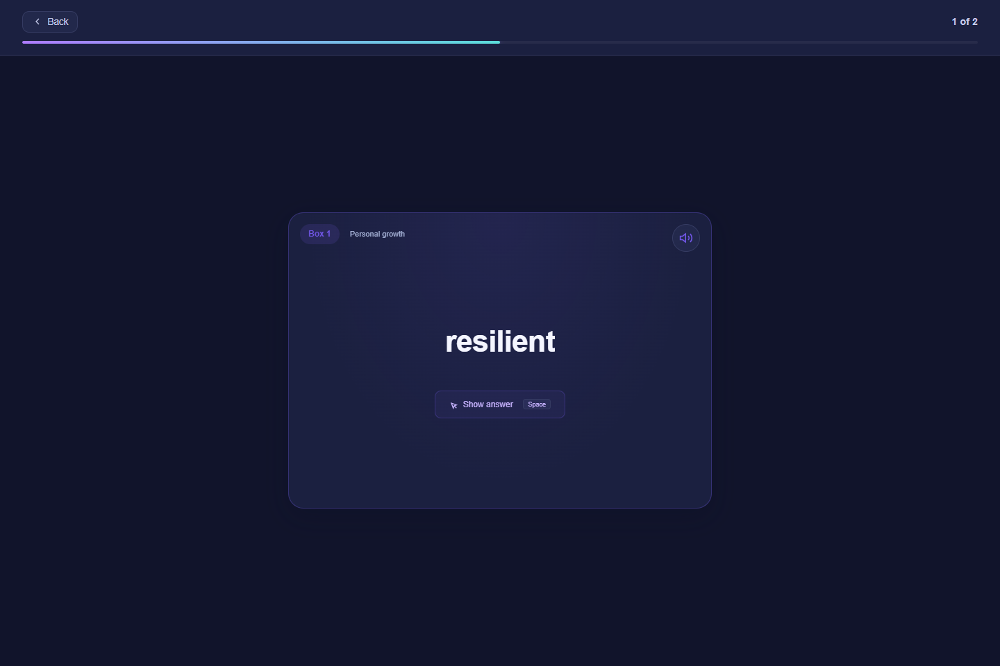
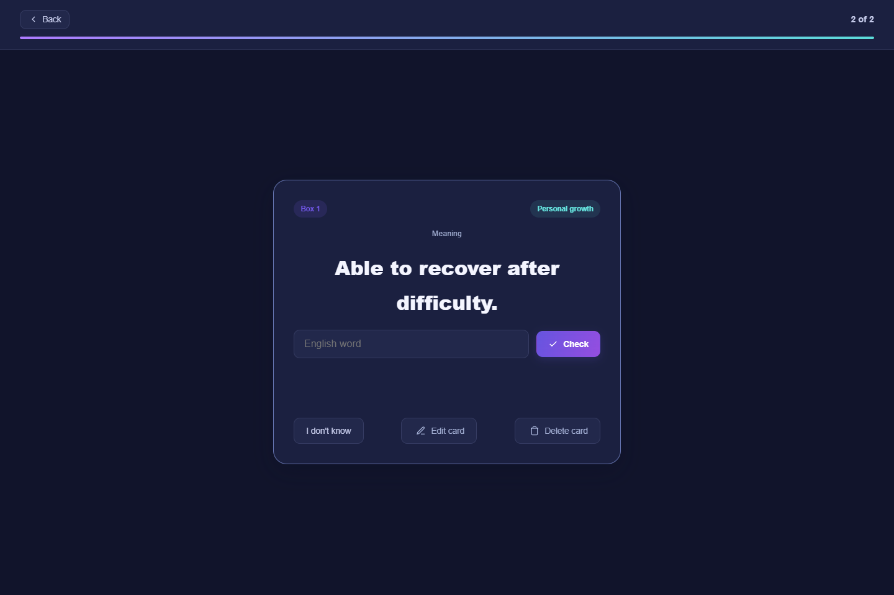
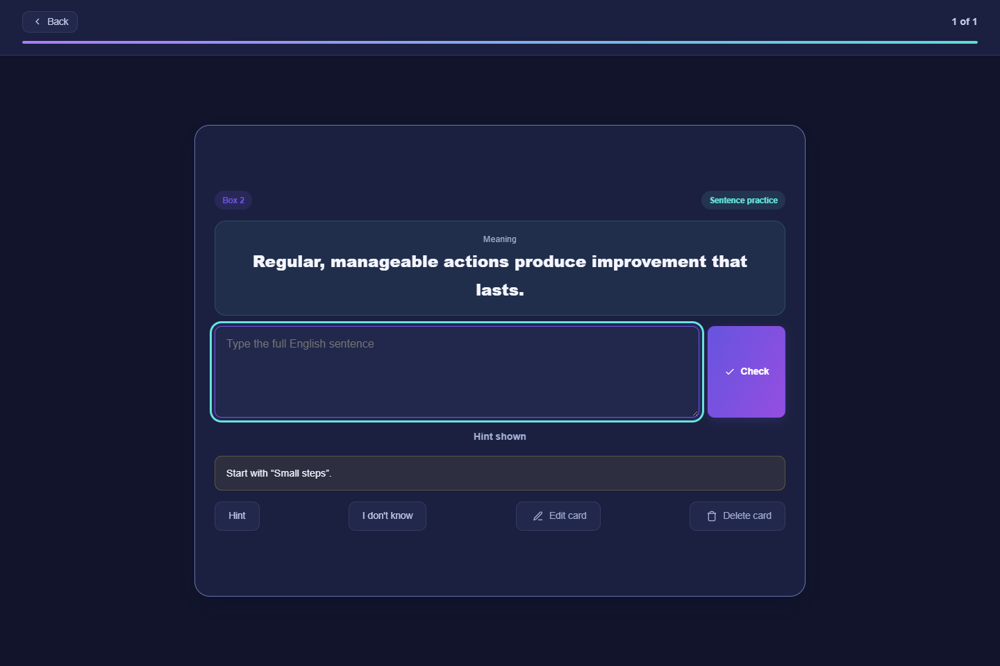
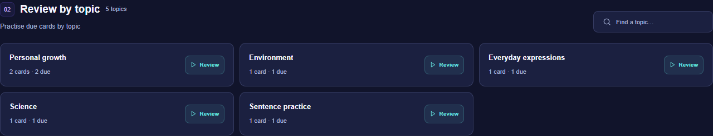
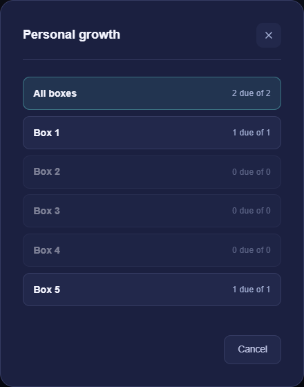
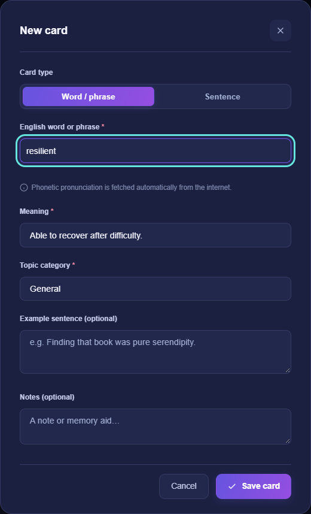

# Leitner Box

<p align="center">
  
</p>

<h1 align="center">Leitner Box</h1>

<p align="center">
  A polished, private desktop app for learning words, phrases, and sentences with spaced repetition.
</p>

<p align="center">
  
  
  
  
  
</p>

<p align="center">
  <a href="https://github.com/imSaDy/leitner-box/releases/latest"><strong>Download the latest release</strong></a>
  ·
  <a href="#quick-start">Quick start</a>
  ·
  <a href="#privacy-first">Privacy</a>
</p>

<p align="center">
  
</p>

## Built for focused, private learning

|                               |                                                                                                        |
| ----------------------------- | ------------------------------------------------------------------------------------------------------ |
| **🧠 Spaced repetition**      | Five Leitner boxes schedule reviews as your memory improves.                                           |
| **🌐 English by default**     | An English interface from first launch, with an optional RTL interface and saved language preferences. |
| **💾 Reliable local storage** | Transactional SQLite writes, stale-window protection, and acknowledged saves protect your progress.    |
| **📦 Backup and restore**     | Create, download, inspect, and explicitly restore local backups.                                       |
| **⌨️ Flexible review**        | Use flashcards, English typing, sentence practice, or a combined workflow.                             |
| **🎨 Designed for daily use** | Responsive layouts, light and dark themes, keyboard shortcuts, and subtle motion.                      |

## Choose how you practise

Select a review mode on the dashboard, then start a due box or a topic. Meanings can be definitions, translations, or personal clues in any language. The interface language never rewrites your cards.

| Method                | How it works                                                                                                                                                                              | Good for                             |
| --------------------- | ----------------------------------------------------------------------------------------------------------------------------------------------------------------------------------------- | ------------------------------------ |
| **Flashcards**        | Recall the meaning, reveal the answer, and select **I knew it** or **I missed it**.                                                                                                       | Quick recall and self-assessment     |
| **English typing**    | Read the meaning and type the word or phrase. Incorrect attempts reveal progressive spelling hints; use **I don't know** to reveal the answer. Select **Next card** to record the result. | Active recall and spelling           |
| **Combined**          | Review a configurable batch as flashcards, then type the same vocabulary. Both stages must be correct for a successful result; each completed card is recorded once.                      | Checking both recognition and recall |
| **Sentence practice** | Sentence cards automatically use a full-sentence exercise in any mode. Read the meaning, use your optional hint, type the sentence, and check the answer.                                 | Practising complete expressions      |

### Flashcards



### English typing



### Combined practice

The batch-size setting controls how many vocabulary cards you see before typing them. A successful result moves a card up one box; a missed result moves it down one box. Leaving halfway through a card does not record its unfinished result. In the other review modes, a missed card returns to Box 1.

<table><tr>
<td width="50%"></td>
<td width="50%"></td>
</tr><tr><td align="center">1. Recall and assess</td><td align="center">2. Type and verify</td></tr></table>

### Sentence practice



## Review by topic

Choose a built-in category or type a new one when creating a card. Use **Review by topic** to find a subject and see its total and due counts. Select **Review**, then choose **All boxes** or one box; only cards due in that topic are included. The dashboard's selected review mode applies to topic sessions too.



<p align="center"></p>

## Create your own cards

Add a word, phrase, or sentence with a meaning and topic. Examples, notes, and sentence hints are optional. Fields follow the direction of the text you enter. New installations start empty unless you explicitly choose sample cards; the English starter set uses English definitions.

<p align="center"></p>

## Quick start

### Requirements

- Windows 10 or 11
- [Node.js 24.11 or later](https://nodejs.org/)

### Install

1. Download the ZIP from the [latest release](https://github.com/imSaDy/leitner-box/releases/latest).
2. Extract it to a permanent folder.
3. Double-click **`Install Leitner.cmd`**.
4. Open **Leitner Box** from the new desktop shortcut.

To run without creating a shortcut, double-click **`Start Leitner.vbs`**. When the local service is ready, this starter opens the browser directly without starting PowerShell. It launches the hidden repair script only if the service is unavailable or outdated. The `.cmd` starter remains available for terminal use.

Daily study works offline. Online pronunciation and web fonts require an internet connection.

## Privacy first

> Every fresh installation starts with an empty database. Releases contain no personal cards, study history, logs, databases, or backups.

All study data stays under the current Windows account:

```text
%LOCALAPPDATA%\LeitnerBox\data\leitner.sqlite
%LOCALAPPDATA%\LeitnerBox\data\backups\
```

Clearing browser storage or moving the application folder does not remove the database. Leitner Box does not upload study data to a server or cloud service.

Each change is staged in the browser's IndexedDB before it is sent to SQLite. If the local service stops or the window closes before an acknowledgement arrives, reopening the app checks the operation ID and completes or reconciles that same change. Keep browser site data until any pending change is confirmed or exported. A per-user Windows scheduled task, `LeitnerBoxLocalService`, runs a windowless Windows Script Host supervisor. It checks local service health, restarts Node after an unexpected exit or failed health checks, and starts again when you sign in. The task has one logon trigger and does not periodically launch PowerShell. To move the application folder, run `Install Leitner.cmd` from the new location so the shortcut and service task point there.

When upgrading from v2.1.3, the first launch checks the database, saves a `before-journal-change` backup, and converts a healthy WAL database to rollback journaling without persistent WAL files. If the check fails, the app stops without replacing your data. Keep the previous database files and use a verified backup for recovery.

Backup restoration never runs automatically or on a timer. A restore only happens after explicit user confirmation, and the app creates a safety backup before replacing current data.

## Highlights

- Review individual boxes or practise due cards by topic
- Search and filter the card library
- Create vocabulary, phrase, and sentence cards
- Store meanings, pronunciation, examples, hints, categories, and notes
- Track accuracy, streaks, review history, and box distribution
- Prevent stale browser windows from overwriting newer changes
- Retry ambiguous saves with the same operation ID
- Recover pending cards and review answers after a browser window closes
- Preserve existing data if a transaction or backup fails midway

## Development

```text
npm ci
npm start
npm run check
npm test
```

Use `npm run dev` for development mode on port `8766`. It stores data separately under `.local-data/development`, so development never touches the everyday database.

Optional environment variables:

| Variable           | Purpose                                     |
| ------------------ | ------------------------------------------- |
| `LEITNER_DATA_DIR` | Choose a different local data directory     |
| `LEITNER_PORT`     | Choose a different local server port        |
| `BROWSER_CHANNEL`  | Run browser tests with `msedge` or `chrome` |

See [`.env.example`](.env.example) for examples.

## Project structure

```text
public/                Page, styles, icons, and public learning content
src/client/            Browser features, services, and UI modules
src/server/            Local HTTP service and configuration
src/server/database/   SQLite schema, transactions, and backups
src/shared/            Validation shared by the client and server
scripts/               Desktop launcher and developer tools
tests/                 Unit, integration, and browser tests
docs/                  Architecture, verification notes, and images
```

Read [the architecture documentation](docs/architecture.md) for storage guarantees and design details.

## Quality checks

The project includes:

- Unit tests for validation, transactions, idempotency, backup safety, and restore behavior
- Integration tests for the local API and private-file boundaries
- Browser regression tests for card creation, review modes, migration, failure recovery, and bilingual UI persistence
- Synthetic-only screenshot generation for public documentation

## License

Released under the [ISC License](LICENSE).
