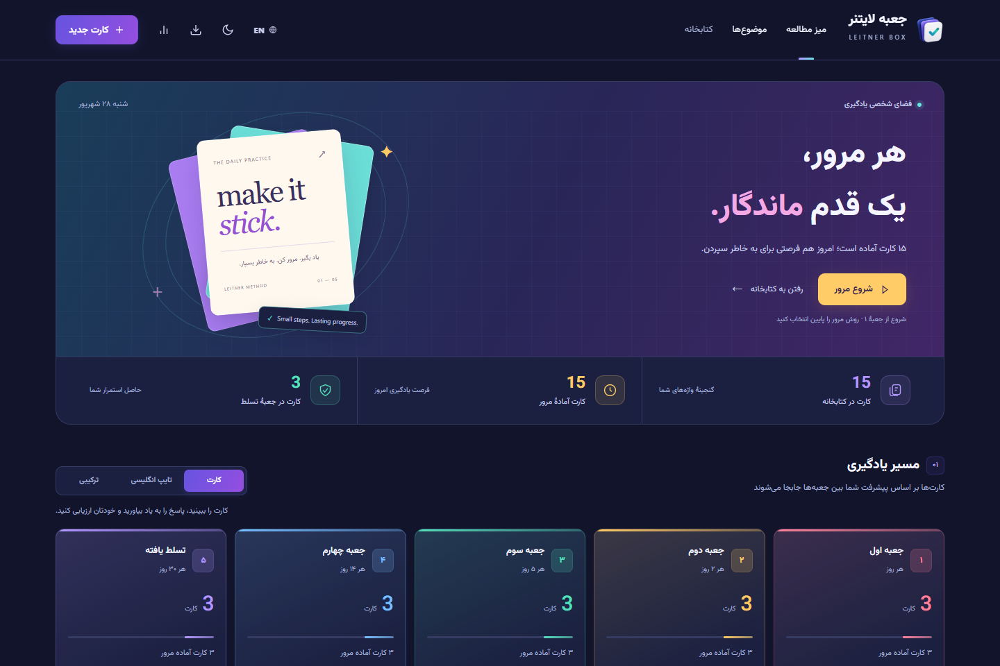

# Leitner Box

<p align="center">
  
</p>

<h1 align="center">Leitner Box</h1>

<p align="center">
  A polished, private desktop app for learning words, phrases, and sentences with spaced repetition.
</p>

<p align="center">
  
  
  
  
  
</p>

<p align="center">
  <a href="https://github.com/imSaDy/leitner-box/releases/latest"><strong>Download the latest release</strong></a>
  ·
  <a href="#quick-start">Quick start</a>
  ·
  <a href="#privacy-first">Privacy</a>
</p>

<p align="center">
  
</p>

## Built for focused, private learning

|                               |                                                                                                     |
| ----------------------------- | --------------------------------------------------------------------------------------------------- |
| **🧠 Spaced repetition**      | Five Leitner boxes schedule reviews as your memory improves.                                        |
| **🌐 Persian and English**    | Switch instantly between a complete RTL Persian interface and an LTR English interface.             |
| **💾 Reliable local storage** | Transactional SQLite writes, stale-window protection, and acknowledged saves protect your progress. |
| **📦 Backup and restore**     | Create, download, inspect, and explicitly restore local backups.                                    |
| **⌨️ Flexible review**        | Use flashcards, English typing, sentence practice, or a combined workflow.                          |
| **🎨 Designed for daily use** | Responsive layouts, light and dark themes, keyboard shortcuts, and subtle motion.                   |

## Bilingual by design

The language button changes labels, messages, dates, numbers, layout direction, and accessibility text. Your card content stays exactly as you entered it.

<table>
  <tr>
    <td width="50%"></td>
    <td width="50%"></td>
  </tr>
  <tr>
    <td align="center"><strong>English · LTR</strong></td>
    <td align="center"><strong>فارسی · راست‌به‌چپ</strong></td>
  </tr>
</table>

## Quick start

### Requirements

- Windows 10 or 11
- [Node.js 24.11 or later](https://nodejs.org/)

### Install

1. Download the ZIP from the [latest release](https://github.com/imSaDy/leitner-box/releases/latest).
2. Extract it to a permanent folder.
3. Double-click **`Install Leitner.cmd`**.
4. Open **Leitner Box** from the new desktop shortcut.

To run without creating a shortcut, double-click **`Start Leitner.cmd`**.

Daily study works offline. Online pronunciation and web fonts require an internet connection.

## Privacy first

> Every fresh installation starts with an empty database. Releases contain no personal cards, study history, logs, databases, or backups.

All study data stays under the current Windows account:

```text
%LOCALAPPDATA%\LeitnerBox\data\leitner.sqlite
%LOCALAPPDATA%\LeitnerBox\data\backups\
```

Clearing browser storage or moving the application folder does not remove the database. Leitner Box does not upload study data to a server or cloud service.

Backup restoration never runs automatically or on a timer. A restore only happens after explicit user confirmation, and the app creates a safety backup before replacing current data.

## Highlights

- Review individual boxes or practise due cards by topic
- Search and filter the card library
- Create vocabulary, phrase, and sentence cards
- Store meanings, pronunciation, examples, hints, categories, and notes
- Track accuracy, streaks, review history, and box distribution
- Prevent stale browser windows from overwriting newer changes
- Retry ambiguous saves with the same operation ID
- Preserve existing data if a transaction or backup fails midway

## Development

```text
npm ci
npm start
npm run check
npm test
```

Use `npm run dev` for development mode on port `8766`. It stores data separately under `.local-data/development`, so development never touches the everyday database.

Optional environment variables:

| Variable           | Purpose                                     |
| ------------------ | ------------------------------------------- |
| `LEITNER_DATA_DIR` | Choose a different local data directory     |
| `LEITNER_PORT`     | Choose a different local server port        |
| `BROWSER_CHANNEL`  | Run browser tests with `msedge` or `chrome` |

See [`.env.example`](.env.example) for examples.

## Project structure

```text
public/                Page, styles, icons, and public learning content
src/client/            Browser features, services, and UI modules
src/server/            Local HTTP service and configuration
src/server/database/   SQLite schema, transactions, and backups
src/shared/            Validation shared by the client and server
scripts/               Desktop launcher and developer tools
tests/                 Unit, integration, and browser tests
docs/                  Architecture, verification notes, and images
```

Read [the architecture documentation](docs/architecture.md) for storage guarantees and design details.

## Quality checks

The project includes:

- Unit tests for validation, transactions, idempotency, backup safety, and restore behavior
- Integration tests for the local API and private-file boundaries
- Browser regression tests for card creation, review modes, migration, failure recovery, and bilingual UI persistence
- Synthetic-only screenshot generation for public documentation

## License

Released under the [ISC License](LICENSE).
